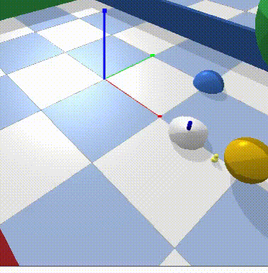

Generic URDF robots
===================

In this package, generic urdf robots and a panda gym environment are
available. The goal is to make this environment as easy as possible to
deploy. Although, we used the OpenAI-Gym framing, these environments are
not necessarly restricted to Reinforcement-Learning but rather to local
motion planning in general.

.. |img4| image:: img/tiagoKeyboardInput.gif
.. |img5| image:: img/panda.gif
.. |img6| image:: img/albert.gif

+--------+--------+--------+
| |img1| | |img2| | |img3| |
+--------+--------+--------+
+--------+--------+--------+
| |img4| | |img5| | |img6| |
+--------+--------+--------+

Getting started
===============

This is the guide to quickle get going with urdf gym environments.

Pre-requisites
--------------

- Python >=3.8
- pip3
- git 

Installation from pypi
-----------------------

The package is uploaded to pypi so you can install it using

.. code:: bash

   pip3 install urdfenvs

Installation from source
-------------------------

You first have to download the repository

.. code:: bash

   git clone git@github.com:maxspahn/gym_envs_urdf.git

Then, you can install the package using pip as:

.. code:: bash

   pip3 install .

The code can be installed in editible mode using

.. code:: bash

   pip3 install -e .

Note that we recommend using poetry in this case.

Optional: Installation with poetry
------------------------------------

If you want to use `poetry <https://python-poetry.org/docs/>`_, you have to install it
first. See their webpage for instructions `docs <https://python-poetry.org/docs/>`_.
.. code:: bash

    poetry install

The virtual environment is entered by

.. code:: bash

    poetry shell

Inside the virtual environment you can access all the examples.

Installing dependencies
-----------------------

Dependencies should be installed through pip or poetry, see below.

Using pip, you can use

.. code:: bash

    pip3 install '.[options]'

Using poetry

.. code:: bash

    poetry install --with <options>

Options are ``keyboard``.

Examples
-----------

You find several python scripts in `examples/
<https://github.com/maxspahn/gym_envs_urdf/tree/master/examples>`_. You can
test those examples using the following (if you use poetry, make sure to enter the virtual
environment first with ``poetry shell``)

.. code:: python

   python3 pointRobot.py

Replace pointRobot.py with the name of the script you want to run.
