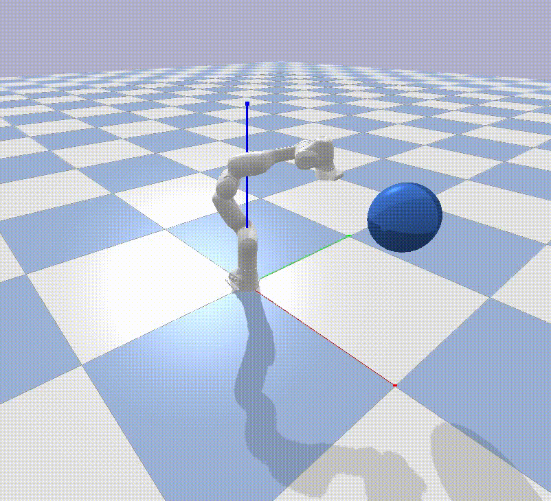
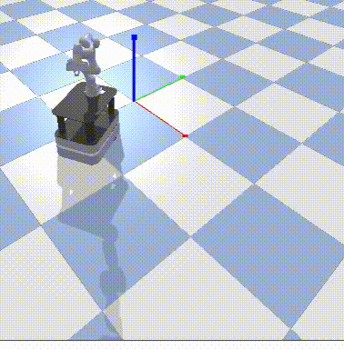

Generic URDF robots
===================

In this package, generic urdf robots and a panda gym environment are
available. The goal is to make this environment as easy as possible to
deploy. Although, we used the OpenAI-Gym framing, these environments are
not necessarly restricted to Reinforcement-Learning but rather to local
motion planning in general.

.. |img1| image:: img/pointRobot.gif
.. |img2| image:: img/pointRobotKeyboardInput.gif
.. |img3| image:: img/boxerRobot.gif
.. |img4| image:: img/tiagoKeyboardInput.gif

+--------+--------+--------+
| |img1| | |img2| | |img3| |
+--------+--------+--------+
+--------+--------+--------+
| |img4| | |img5| | |img6| |
+--------+--------+--------+

Installation
============

This package depends on casadi for dynamics generation and gym.
Dependencies should be installed through pip or poetry, see below.

Using pip, you can use

.. code:: bash

    pip3 install '.[options]'

Using poetry

.. code:: bash

    poetry install -E <options>

Options are ``keyboard`` and ``scenes``.

Switching
=========

Environments can be created using the normal gym syntax. For example the
below code line creates a planar robot with 3 links and a constant k.
Actions are torques to the individual joints.

.. code:: python

    env = gym.make('nLink-urdf-reacher-vel-v0', n=3, dt=0.01, render=True)

A holonomic and a differential drive mobile manipulator are implemented:

.. code:: python

    env = gym.make('albert-reacher-vel-v0', dt=0.01, render=True)
    env = gym.make('mobile-reacher-tor-v0', dt=0.01, render=True)

For most robots, different control interfaces are available, velocity
control, acceleration control and torque control.

Robot control with the keyboard
===============================

Control robot actuators with keyboard keys. This is done by: \* setting
up a parent en child process with a pipe connection inbetween \* setup
and start main process with parent\_connection as arguement \* setup
Responder object with child\_connection as arguement \* start Responder
with parent process as arguement

In the main loop an request for action should be made followed by
wainting for a response as such:

.. code:: python

    parent_conn.send({"request_action": True})
    keyboard_data = parent_conn.recv()
    action = keyboard_data["action"]

An example can be found in examples/keyboard\_input\_example.py

Examples
========

Examples can be found in the corresponding folder.
