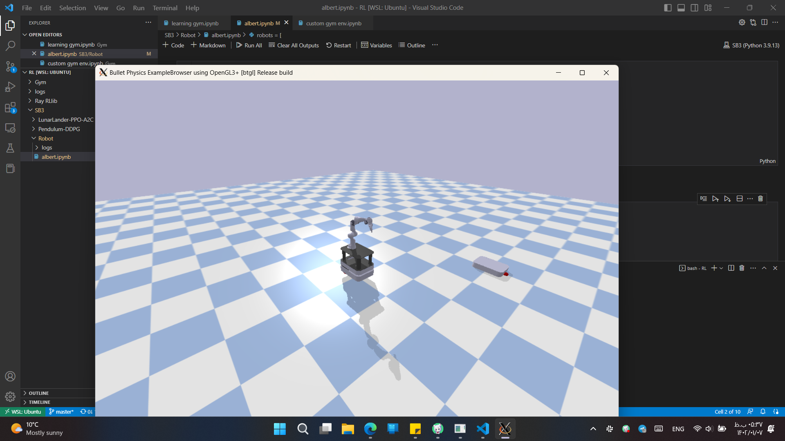

.. role:: raw-latex(raw)
   :format: latex
..

Installation using windows
===========================

Making the windows system run!
------------------------------

Python
~~~~~~

First, you have to install a minimum version of python. Python 3.10.4
can be found https://www.python.org/downloads/release/python-3104/

Python is usually installed in
:file:`C:\\Users\\<User-Name>\\AppData\\Local\\Programs\\Python\\Python310\\python.exe`.
You can find the exact location by running the python interpreter from
the start menu. Simply search for python after you have installed with
the link from above. You can then launch the interpreter. In there you
run:

.. code:: python

    import sys
    print(sys.executable) # prints the location of the python executable.

For for information you can also look at
https://blog.finxter.com/how-to-find-path-where-python-is-installed-on-windows/.

Git
~~~

We recommand installing git for windows from https://gitforwindows.org/.
Follow the installation guide. This program will also offer you a
minimal linux-link terminal. Very helpful to learn the very basics of
linux commands.

Just like with the python interpreter, you can now open a git-bash
command line by searching for the program in the start menu. You can now
navigate around with the normal linux commands: - ls : list content of
current directory - cd : change directory to - pwd : show current path

In order to interact with github you should first setup a ssh-key to
facilitate the communication with github. You can follow the
documentation on the github docu page:
https://docs.github.com/en/authentication/connecting-to-github-with-ssh.

Once git is setup you download the repository by clicking on its github
website, https://github.com/maxspahn/gym\_envs\_urdf, on the clone
button in green. This link is then added to your clipboard. Inside the
git-bash terminal you then paste:

.. code:: bash

    git clone git@github.com:maxspahn/gym_envs_urdf.git

If it is your first time using git, you may be asked to add github to
the known-hosts list for the ssh configuration. You confirm that by
typing ``yes``.

You have successfully downloaded the package. Installation will be
covered once all other dependencies are setup.

C++
~~~

Some dependencies of the package require C++. If you already have visual
studio installed, you should already have the C++ compiler. If not, we
recommand installing visual studio, even though it introduces some
overhead.

Poetry
~~~~~~

We recommand using poetry to install the package. It also allows you to
interact with the package and make custom changes or add third party
libraries. You can install it according to their documentation
https://python-poetry.org/docs/. Open a powershell and paste

.. code:: powershell

    (Invoke-WebRequest -Uri https://raw.githubusercontent.com/python-poetry/poetry/master/get-poetry.py -UseBasicParsing).Content | py 

Sometimes, ``py`` needs to be replaced with ``python``. You can find out
which to use by simply typing both and see which one opens the python
interpreter terminal.

Windows Subsystem for Linux (WSL2 with vcXsrv)
~~~~~~~~~~~~~~~~~~~~~~~~~~~~~~~~~~~~~~~~~~~~~~

Since the underlying physics engine used in this package is PyBullet, you will need to install a few additional Visual Studio packages to handle C++ code. This process is time-consuming and prone to future errors and faults. Since these Python packages are built and maintained on Linux machines, you won't get the intended performance inside Windows. It's possible (and common) to face weird issues and bugs. 

WSL2 (Windows subsystem for Linux) is the middle-ground between installing Ubuntu and using this package on Windows. With WSL2, you can use a Linux terminal and GUI inside your Windows machine without interference and problems. Please note that WSL2 is not a virtual machine (VM). This feature is available in all versions of Windows 10 & 11 and is free. The primary difference between WSL1 and WSL2 is that WSL2 uses a virtual machine to provide a Linux kernel instead of translating system calls like WSL1. While WSL2 can run Linux commands, it doesn't include a graphical user interface (GUI). However, users can install and use a third-party software called vcXsrv to run Linux GUI applications on Windows.

In order to use this feature, you need to enable virtualization technology in the BIOS, which varies from vendor to vendor. 

We recommand following the installation processes written by Microsoft (https://learn.microsoft.com/en-us/windows/wsl/) and Ubuntu (https://ubuntu.com/tutorials/install-ubuntu-on-wsl2-on-windows-11-with-gui-support#5-install-and-use-a-gui-package). 

Please note that in order to get full support of external GUIs of WSL2 inside Windows machine and don't face fatal errors, you have to install vcXsrv and configure your subsystem to use it. You can download and install this software from https://sourceforge.net/projects/vcxsrv/ and configure it based on information in this page https://aalonso.dev/blog/how-to-use-gui-apps-in-wsl2-forwarding-x-server-cdj. After successfull installation you should be able to run PyBullet, RVIZ, Gazebo, and else without any problems. 

+--------+
| |img1| |
+--------+
